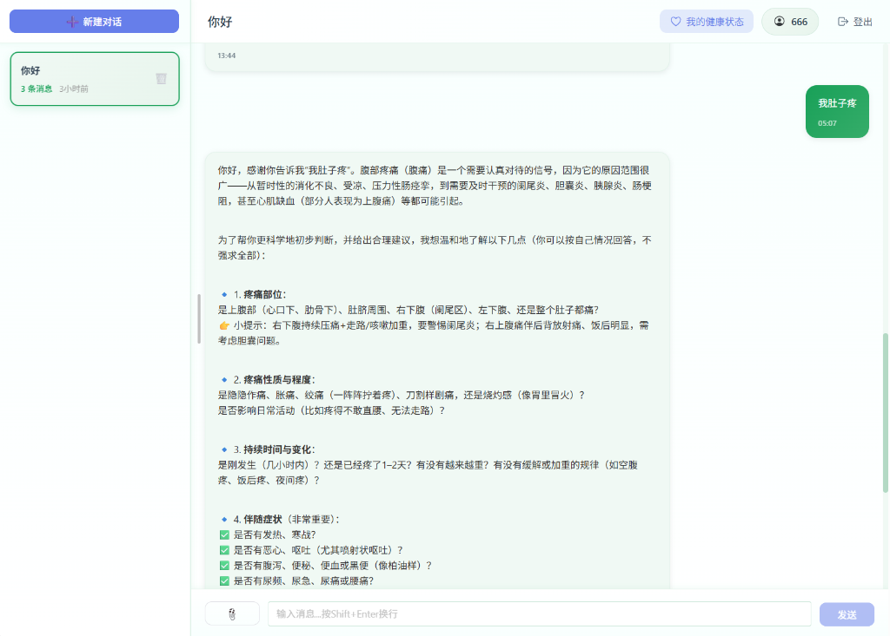
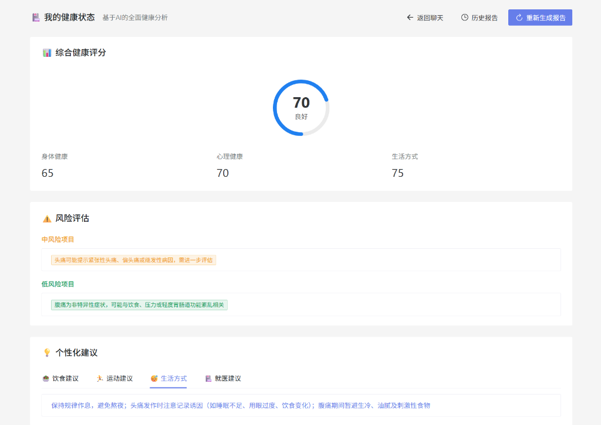

# 🤖 AI健康管理助手

## 🎯 项目简介

这是一个专注于**健康管理**的AI智能对话平台，用户可以通过文字、文件上传等方式与AI助手进行健康咨询。系统支持多会话管理、智能文件分析、健康报告解读、RAG知识库检索增强等专业功能。

## 📸 效果预览

### 💬 智能健康咨询对话


### 📊 健康状态仪表盘


## ✨ 核心功能

### 🏥 健康管理专业咨询
- ✅ 健康生活方式建议（饮食、运动、睡眠）
- ✅ 体检报告智能分析与解读
- ✅ 健康指标异常提醒与建议
- ✅ 慢性病日常管理指导
- ✅ 营养与体重管理咨询
- ✅ **三维度健康评分系统**
  - 身体健康评分：基于症状、疾病史、体检数据
  - 心理健康评分：基于情绪、压力、睡眠质量
  - 生活方式评分：基于作息、运动、饮食习惯
  - AI 智能评分生成，比关键词提取更准确

### 📚 RAG 全局健康知识库
- ✅ **预置专业文档**：体检指标参考范围、慢性病管理指南、营养饮食指南
- ✅ **语义检索**：用户提问时自动检索最相关的健康知识片段注入 Prompt
- ✅ **知识库扩展**：运行 `build_knowledge_base.py` 可随时增量追加新文档
- ✅ **回答更专业**：AI 能引用真实文档中的具体数值而非凭空推测

### ⚡ Redis 缓存加速
- ✅ **Cache-Aside 会话缓存**：对话历史优先从 Redis 读取，减少 MongoDB IO
- ✅ **JWT 黑名单登出**：用户退出后 Token 立即失效，解决无状态 JWT 的安全问题
- ✅ **降级处理**：Redis 不可用时自动降级，不影响核心功能

### 📄 智能文件分析
- ✅ **文本文件**：支持 TXT、Word 文档智能分析
- ✅ **图片文件**：支持体检报告、医疗图像 OCR 识别
- ✅ **PDF 文件**：支持多页健康文档处理
- ✅ **智能提取**：自动识别关键健康信息

### 💬 智能对话体验
- ✅ **多轮对话记忆**：AI 自动记住最近 10 轮对话上下文
- ✅ **多会话管理**：支持同时管理多个健康咨询会话
- ✅ **流式输出**：AI 回复实时显示（SSE），无需等待
- ✅ **Markdown 渲染**：支持富文本格式显示

### 🔒 安全与隐私
- ✅ **数据隔离**：用户数据完全隔离存储
- ✅ **JWT 认证**：安全的用户身份验证
- ✅ **Token 黑名单**：退出登录后 Token 立即失效（Redis）
- ✅ **文件安全**：严格的文件类型和大小验证

## 🛠️ 技术栈

### 前端技术
- **Vue 3** - 渐进式 JavaScript 框架
- **TypeScript** - 类型安全的 JavaScript 超集
- **Vite** - 快速的构建工具
- **Naive UI** - 美观的 Vue 3 组件库

### 后端技术
- **FastAPI** - 高性能 Python Web 框架
- **LangChain** - AI 应用开发框架（ChatTongyi 集成）
- **SQLAlchemy** - 异步 ORM 框架
- **Motor** - 异步 MongoDB 驱动
- **阿里百炼 (DashScope)** - AI 大模型服务

### 缓存与检索
- **Redis** - 会话历史缓存 + JWT Token 黑名单
- **FAISS** - 本地向量数据库，支持全局知识库语义检索
- **DashScope Embeddings** - 文本向量化（text-embedding-v2）

### 数据库
- **MySQL** - 用户信息和会话管理
- **MongoDB** - 聊天记录和文件数据

### AI 模型
- **qwen-plus** - 对话模型（支持多轮上下文）
- **qwen-long** - 长文本分析模型
- **qwen-vl-plus** - 视觉理解模型（体检图片 OCR）

## 📁 项目结构

```
health-chat/
├── frontend/                 # 前端项目
│   ├── src/
│   │   ├── api/             # API 接口
│   │   ├── components/      # Vue 组件
│   │   ├── store/           # 状态管理
│   │   ├── views/           # 页面视图
│   │   └── types/           # TypeScript 类型
│   └── package.json
├── backend/                  # 后端项目
│   ├── app/
│   │   ├── dao/             # 数据访问对象
│   │   ├── routes/          # API 路由
│   │   ├── services/        # 业务逻辑
│   │   │   ├── ai_service.py        # LangChain AI 服务
│   │   │   ├── redis_service.py     # Redis 缓存服务
│   │   │   ├── rag_service.py       # RAG 知识库服务
│   │   │   └── health_analysis_service.py
│   │   └── utils/           # 工具函数
│   ├── knowledge_docs/      # 健康知识文档（RAG 知识库来源）
│   │   ├── 体检指标参考范围.txt
│   │   ├── 慢性病管理指南.txt
│   │   └── 营养与饮食指南.txt
│   ├── vector_stores/       # FAISS 向量库（自动生成）
│   │   └── global/          # 全局知识库
│   ├── build_knowledge_base.py  # 一键建库脚本
│   ├── models/              # 数据模型
│   ├── config/              # 配置文件
│   └── requirements.txt
└── README.md
```

## 🚀 快速开始

### 环境要求
- Docker & Docker Compose **(推荐方式)**
- 或 Node.js 16+ & Python 3.11+ (手动开发方式)
- 数据库：MySQL 8.0, MongoDB 6.0, Redis 5.0

---

### 方式一：Docker 一键部署 (推荐) 🐳

1. **获取配置文件**
   下载并保存 `docker-compose.yml` 到本地文件夹。

2. **配置环境变量**
   打开 `docker-compose.yml`，在 `backend` 服务下的 `environment` 栏目填入你的密钥：
   ```yaml
   environment:
     - DASHSCOPE_API_KEY=你的阿里云百炼密钥  # 👈 填入这里
   ```

3. **一键启动**
   ```bash
   docker-compose up -d
   ```
   *服务会自动拉取镜像并启动。*

---

### 方式二：手动开发部署 💻

#### 1. 克隆项目
```bash
git clone https://github.com/baoozak/health-chat.git
cd health-chat
```

#### 2. 配置环境
```bash
# 复制环境配置模板
cp backend/.env.txt backend/.env
# 编辑 .env，填写内容
```

#### 3. 环境准备
确保已安装以下服务：
- MySQL 8.0+
- MongoDB 6.0+
- Redis 5.0+

#### 4. 启动后端
```bash
cd backend
python -m venv venv
venv\Scripts\activate       # Windows
source venv/bin/activate    # Linux/Mac

pip install -r requirements.txt

# 构建 RAG 健康知识库（首次运行）
python build_knowledge_base.py

# 启动服务
uvicorn app.main:app --reload
```

### 5. 启动前端
```bash
cd frontend
npm install
npm run dev
```

## 📚 健康知识库管理

### 首次建库
```bash
cd backend
python build_knowledge_base.py
```

### 新增知识文档
将 `.txt` 文件放入 `backend/knowledge_docs/`，然后：
```bash
python build_knowledge_base.py         # 增量追加，不覆盖原有知识
```

### 清空重建
```bash
python build_knowledge_base.py --rebuild
```

### 自定义文档目录
```bash
python build_knowledge_base.py --docs-dir /path/to/your/docs
```

## 🔬 健康评分系统

### 三维度评分体系
- **身体健康评分**（0-100 分）：基于症状描述、疾病史、体检数据
- **心理健康评分**（0-100 分）：基于情绪状态、压力水平、睡眠质量
- **生活方式评分**（0-100 分）：基于作息规律、运动习惯、饮食健康
- **综合健康评分**：三项子评分的平均值

### 评分等级标准
- **90-100 分**：优秀状态，保持良好习惯
- **70-89 分**：良好状态，有改善空间
- **50-69 分**：需要关注，建议调整生活方式
- **0-49 分**：需要重视，建议咨询专业医生

## ⚠️ 重要声明

**本项目仅供学习和健康管理咨询使用，不构成医疗建议：**
- ❌ 不提供疾病诊断服务
- ❌ 不开具药物处方
- ❌ 不替代专业医疗意见
- ❌ 不推荐手术或医疗程序

**如有身体不适，请及时就医，紧急情况请拨打 120！**

## 📄 许可证

MIT License - 详见 [LICENSE](LICENSE) 文件

---

**🎉 开始你的 AI 健康管理之旅吧！**
